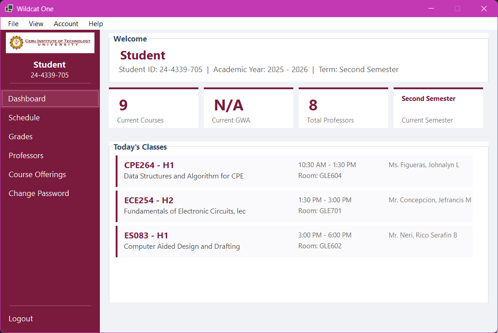
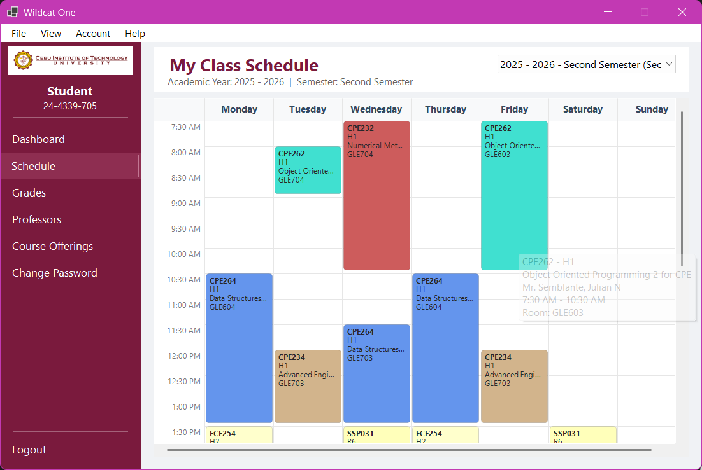
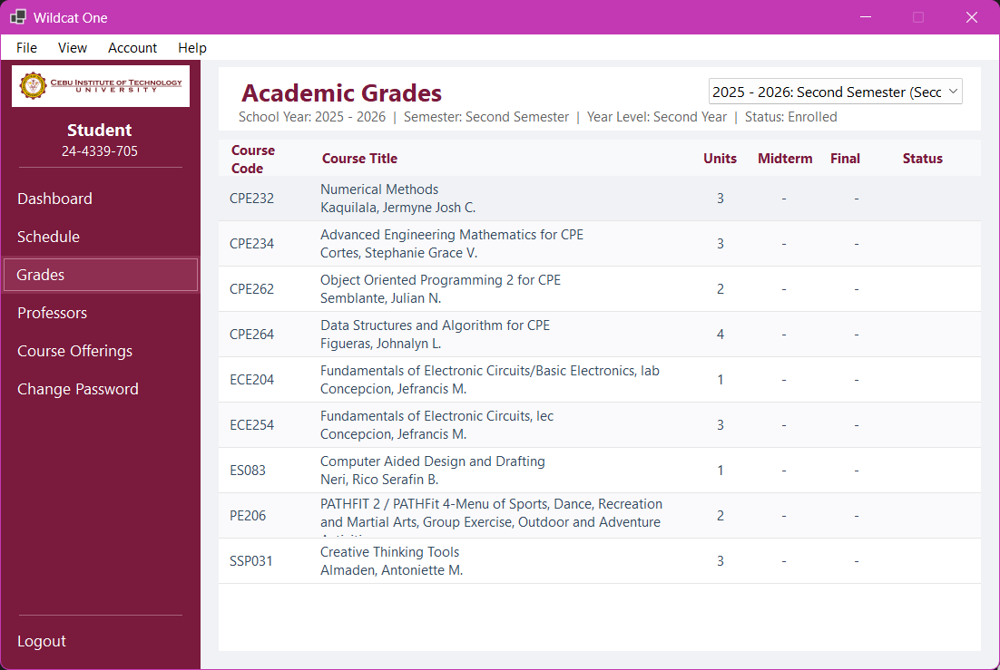
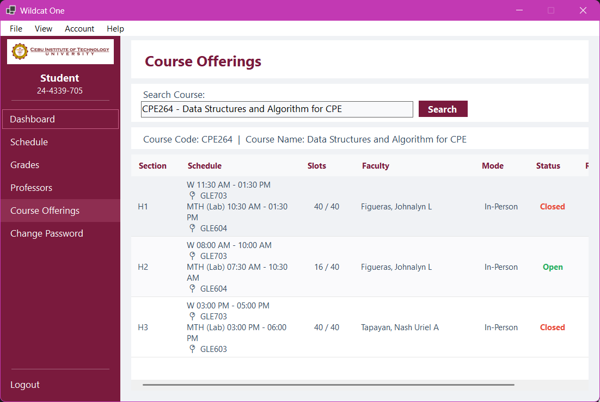

# Wildcat One

A faster, cleaner Windows desktop client for the CIT-U student portal. Built by a student, for students.

> **Not an official CIT-U application.** This is an independent wrapper — your credentials go directly to CIT-U's servers. No data is collected or stored by this app.

---

## Screenshots

<table>
  <tr>
    <td></td>
    <td></td>
  </tr>
  <tr>
    <td align="center"><em>Dashboard</em></td>
    <td align="center"><em>Class Schedule</em></td>
  </tr>
  <tr>
    <td></td>
    <td></td>
  </tr>
  <tr>
    <td align="center"><em>Academic Grades</em></td>
    <td align="center"><em>Course Offerings</em></td>
  </tr>
</table>

---

## Features

- **Dashboard** — at-a-glance summary of your current courses, GWA, professors, and today's class schedule
- **Class Schedule** — color-coded weekly timetable with hover tooltips; switch between semesters
- **Academic Grades** — midterm and final grades per semester with enrollment status
- **Professors** — list of your professors by course for any semester
- **Course Offerings** — search any course and see all sections with slots, schedule, faculty, mode, and open/closed status
- **Change Password** — OTP-verified two-step password change
- **Forgot Password** — reset via Student ID and birthdate

---

## Installation

### Option 1 — Download the installer (recommended)

1. Go to the [Releases](https://github.com/dreeyanzz/wildcat-one-windows/releases/latest) page.
2. Download the latest `.exe` installer.
3. Run it and follow the setup wizard.

**Requires:** Windows 10 or later.

### Option 2 — Build from source

**Requires:** [.NET 10.0 SDK](https://dotnet.microsoft.com/download/dotnet/10.0) and Windows.

```bash
git clone https://github.com/dreeyanzz/wildcat-one-windows.git
cd wildcat-one-windows
dotnet run
```

To produce a release build:

```bash
dotnet publish -c Release -r win-x64 --self-contained false
```

---

## Contributing

Issues and pull requests are welcome. If you find a bug or have a feature idea, [open an issue](https://github.com/dreeyanzz/wildcat-one-windows/issues) first so we can discuss it before you start coding.

When submitting a PR:
- Keep changes focused — one feature or fix per PR.
- Test on Windows before submitting.
- Do not hand-edit `Form1.Designer.cs` or `LoginForm.Designer.cs`; UI layout changes should be made through the Visual Studio form designer.

---

## License

[MIT](LICENSE)

---

## Disclaimer

Wildcat One is not affiliated with or endorsed by Cebu Institute of Technology – University. All student data displayed in the app comes directly from CIT-U's official systems. This app is simply a different interface for viewing it.
